# Anigine: Animation Rendering Engine

**Anigine**(Animation + Engine)은 지능형 이미지 분석과 고급 필터링 알고리즘을 결합하여, 일반 사진을 감각적인 애니메이션 스타일로 변환하는 렌더링 엔진입니다.

---

## 결과물 미리보기 및 데모 (Visual Previews & Demos)

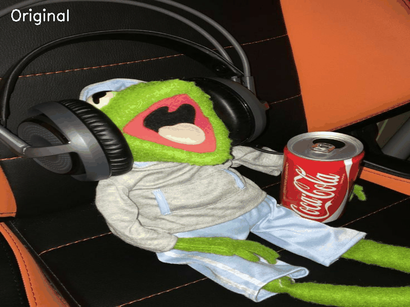

### 1. 성공적인 렌더링 사례 (Best Cases)
Anigine은 색 대비가 명확하고 구조가 뚜렷한 이미지에서 가장 뛰어난 성능을 발휘합니다.

| 게임 그래픽 스타일 | 명암 대비와 색감 보정 | 인물 및 근접 촬영 |
|:---:|:---:|:---:|
| 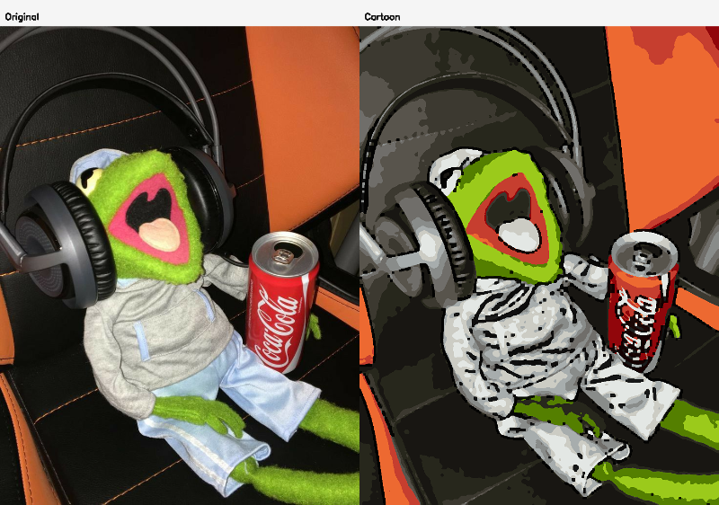 | 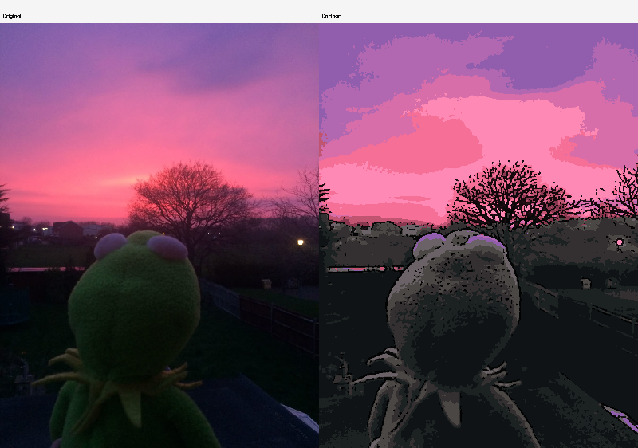 | 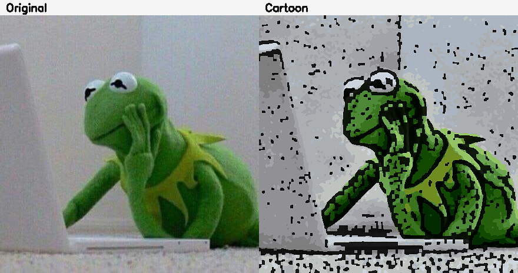 |
| **분석**: 단순화된 색면과 강렬한 외곽선이 조화를 이루어 전형적인 애니메이션 스타일을 구현합니다. | **분석**: 노을과 같은 그라데이션을 K-Means 퀀타이징을 통해 감각적인 색 분할로 변환합니다. | **분석**: 인물의 특징을 유지하면서 피부 톤을 매끄럽게 처리하고 적절한 채도 보정을 적용합니다. |

| 고화질 풍경 및 건물 | 대담한 색 분리 (Color-pop) | 활기찬 색감 (Vibrant) |
|:---:|:---:|:---:|
| 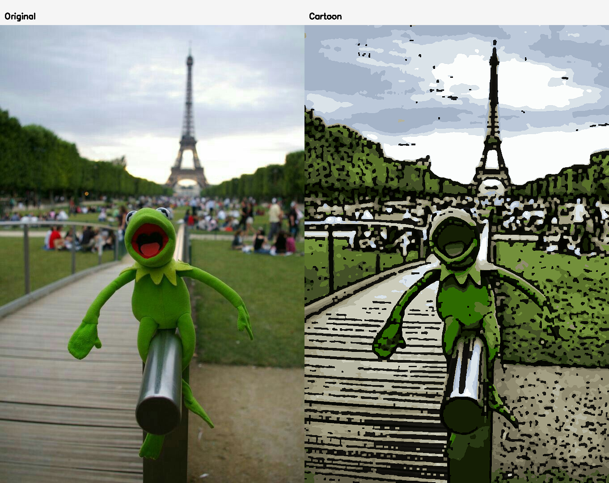 | 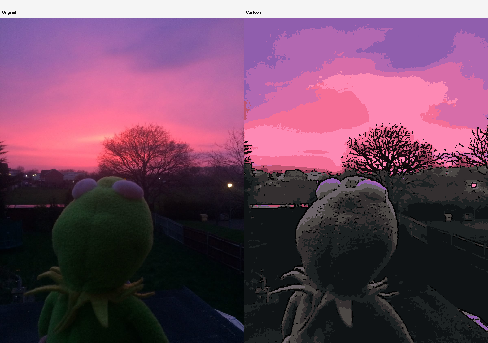 | 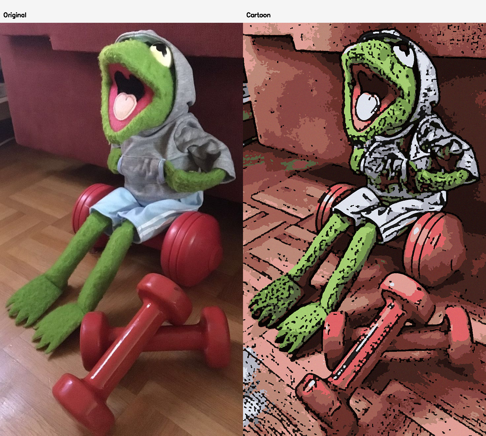 |
| **분석**: 복잡한 요소가 많은 고화질 이미지에서도 주요 구조를 놓치지 않고 깔끔하게 렌더링합니다. | **분석**: 어두운 환경의 노을을 강렬한 색 대비로 표현하여 팝아트적인 느낌을 강조합니다. | **분석**: 실내 조명 아래의 피사체를 생동감 있는 색상으로 변환하여 역동성을 부여합니다. |

### 2. 도전적인 사례 및 한계 (Challenging Cases)
알고리즘의 특성상 표현이 까다롭거나 의도와 다르게 출력될 수 있는 경우입니다.

| 얇은 선의 소실 (Extreme Thin Lines) | 저조도 노이즈의 왜곡 (Low Light Noise) | 과도한 노이즈와 텍스처 |
|:---:|:---:|:---:|
| 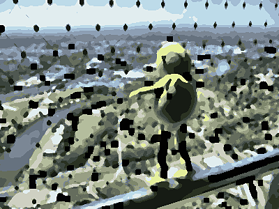 | 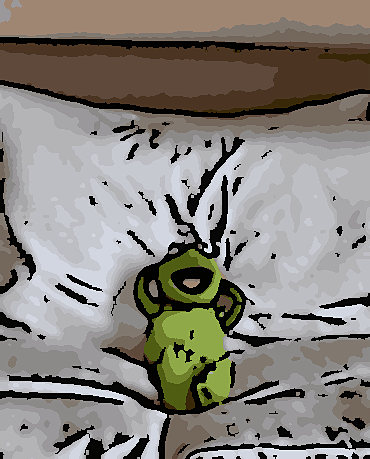 |  |
| **현상**: `--dot-noise-suppression`을 높게 설정할 경우, 얇은 철조망 선이 끊기거나 사라집니다. | **현상**: 광량이 부족한 곳의 입자 노이즈가 에지로 오인되어 지저분한 검은 점들이 생성됩니다. | **현상**: 미세한 텍스처가 너무 많을 경우, 점 노이즈 억제 필터가 디테일을 뭉개버릴 수 있습니다. |

| 고노이즈 이미지의 뭉개짐 | 역광 및 암부 디테일 소실 | 포커스 아웃/블러 이미지 |
|:---:|:---:|:---:|
| 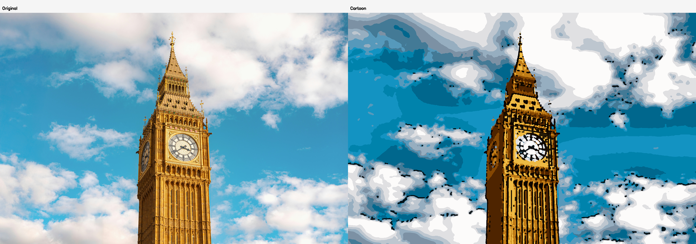 | 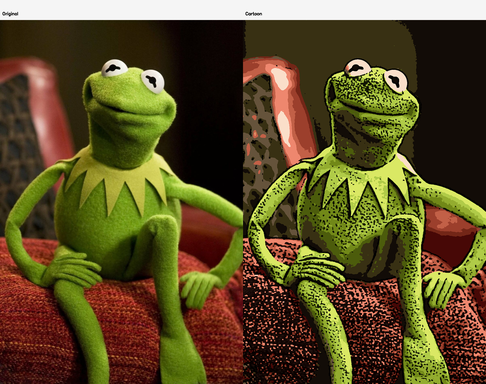 | 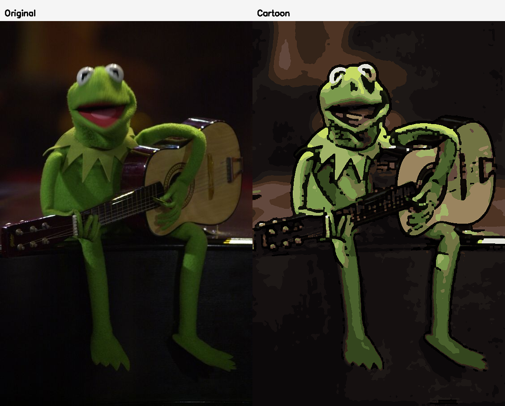 |
| **현상**: 원본의 노이즈가 심할 경우, 스무딩 과정에서 형태가 모호해지는 경향이 있습니다. | **현상**: 암부가 지배적인 이미지에서는 에지 검출이 어려워 구조가 단순화될 위험이 있습니다. | **현상**: 초점이 맞지 않거나 흔들린 이미지는 에지 검출이 부정확하여 만화적 느낌이 반감됩니다. |

---

## 데모 및 한계점 논의 (Discussion of Demos & Limitations)

### 1. 알고리즘의 강점 (Strengths)
- **지능형 적응성**: `auto` 프리셋을 통해 이미지의 통계(채도, 에지 밀도, 노이즈)를 분석하고, 최적의 파라미터를 동적으로 설정하여 일관된 품질을 유지합니다.
*   **깔끔한 외곽선**: Adaptive Threshold와 Morphological 후처리를 결합하여, 단순한 Canny Edge보다 훨씬 깨끗하고 "잉크 느낌"이 나는 윤곽선을 추출합니다.

### 2. 알고리즘의 한계점 (Limitations)
1.  **디테일과 노이즈의 트레이드오프**: 
    - 점 노이즈를 제거하기 위한 형태학적 연산(Morphology)은 이미지의 아주 미세한 디테일(예: 멀리 있는 나뭇가지, 머리카락 한 올)을 함께 지워버리는 경향이 있습니다.
2.  **K-Means 퀀타이징의 색상 왜곡**:
    - 색상 수를 제한하는 과정에서 부드러운 그라데이션이 계단 현상(Banding)으로 나타나며, 중요도가 낮은 색상이 지배적인 색상에 흡수되어 사라질 수 있습니다.
3.  **조명 조건에 따른 민감도**:
    - 매우 어둡거나 역광이 심한 이미지에서는 CLAHE 보정으로도 극복하기 힘든 아티팩트(Artifact)가 발생하며, 특히 암부 노이즈가 검은색 에지로 증폭되는 문제가 있습니다.
4.  **계산 복잡도**:
    - 고해상도 이미지에서 K-Means 클러스터링과 Bilateral 필터링을 반복 적용할 경우 처리 시간이 급격히 증가하는 성능상의 한계가 존재합니다.

---

## 주요 기능 (Key Features)

- **지능형 자동 모드 (--preset auto)**: 이미지의 채도, 에지 밀도, 노이즈 레벨을 정밀 분석하여 최적의 렌더링 파라미터를 동적으로 생성합니다.
- **다양한 스타일 프리셋**: 
    - classic: 표준적인 애니메이션 느낌
    - vibrant: 강렬한 색감과 높은 채도
    - color-pop: 팝아트 스타일의 대담한 색 분리
    - ink: 굵고 명확한 외곽선 중심의 스타일
    - soft: 부드럽고 몽환적인 수채화풍 느낌
- **정밀한 에지 검출 (Ink Edges)**: Adaptive Threshold와 Canny 알고리즘을 결합하고 형태학적 후처리를 통해 블랙 도트 노이즈가 없는 깔끔한 윤곽선을 추출합니다.
- **대량 일괄 처리 (Batch Processing)**: 폴더 내의 수많은 이미지를 한 번에 변환하며, 각 이미지별 처리 근거가 담긴 Markdown 리포트를 자동 생성합니다.
- **사용자 정의 제어**: 점 노이즈 억제 강도(--dot-noise-suppression), 최대 해상도(--max-side) 등을 직접 조절 가능합니다.

---

## 점 노이즈 억제 효과 (Dot Noise Suppression Effect)

`--dot-noise-suppression` 옵션은 애니메이션 렌더링 시 발생하는 지저분한 점 노이즈를 제거하는 강도를 조절합니다. 값이 커질수록 작은 점들이 사라지고 윤곽선이 깔끔해지지만, 세밀한 디테일이 함께 사라질 수 있습니다.

### 1. 철조망 예시 (Wire Fence Example)
복잡한 선과 점이 많은 이미지에서 억제 강도에 따른 변화입니다.

| 사진으로 비교 (Grid View) | 애니메이션으로 비교 (GIF View) |
|:---:|:---:|
| 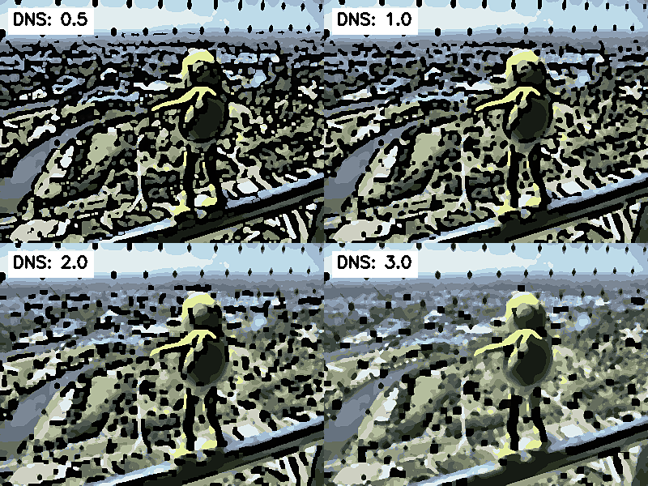 | 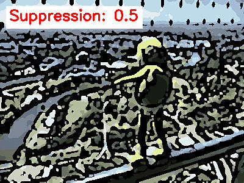 |

### 2. 예시 이미지 6 (Example 6)
일반적인 사물/풍경에서의 변화입니다.

| 사진으로 비교 (Grid View) | 애니메이션으로 비교 (GIF View) |
|:---:|:---:|
| 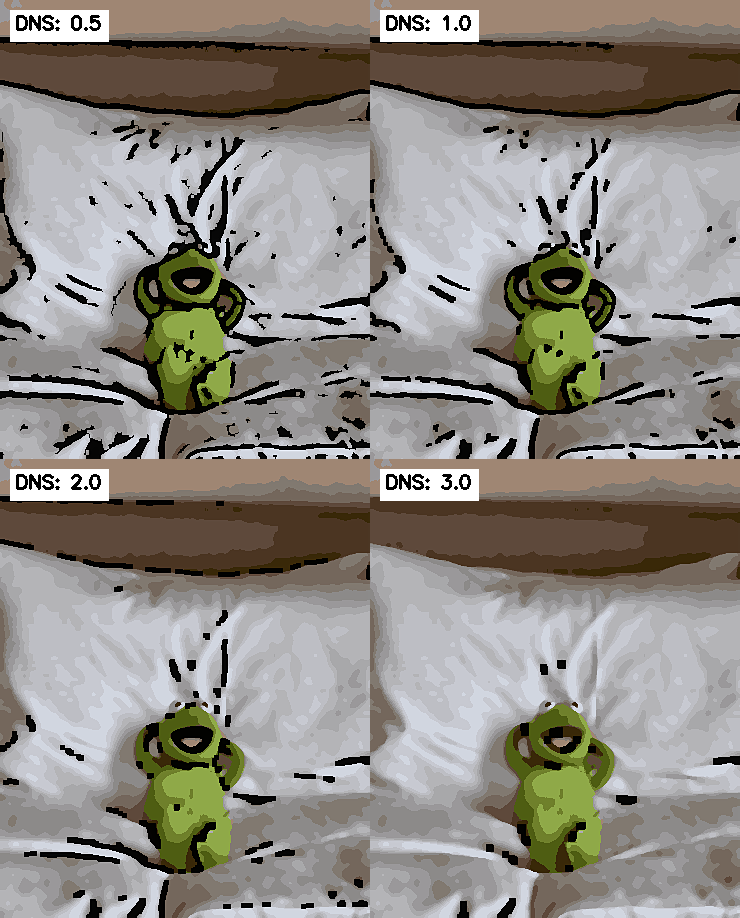 | 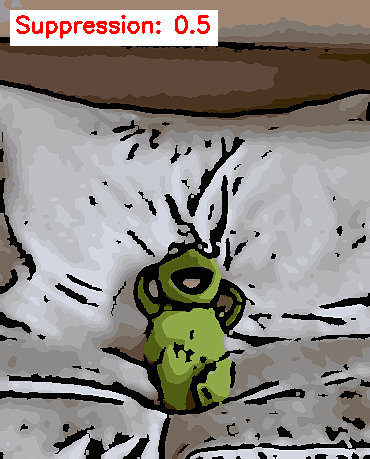 |

### 억제 강도에 따른 변화 및 장단점

| 강도 (Value) | 특징 (Characteristics) | 장점 (Pros) | 단점 (Cons) |
|:---:|---|---|---|
| **Low (0.5~0.8)** | 세밀한 선과 점을 최대한 보존 | 아주 작은 디테일까지 표현 가능 | 지저분한 점 노이즈가 많이 남음 |
| **Default (1.0)** | 균형 잡힌 노이즈 제거와 디테일 | 대부분의 이미지에 적합한 표준 품질 | 특수한 질감의 이미지는 최적화 필요 |
| **High (2.0~3.0)** | 강력한 형태학적 필터링 적용 | 매우 깔끔하고 정돈된 느낌 | 얇은 선이나 세밀한 텍스처가 뭉개짐 |

- **장점**: 지저분한 "개미 노이즈"를 제거하여 인쇄물이나 애니메이션 같은 깔끔한 면 처리가 가능합니다.
- **단점**: 너무 높게 설정하면 철조망의 얇은 선이나 사람의 눈썹, 머리카락 같은 중요한 세부 묘사가 사라질 수 있습니다.

---


## 사용법 및 실행 예시 (Usage Examples)

### 1. 단일 이미지 변환 (자동 최적화)
이미지를 분석하여 가장 잘 어울리는 설정을 자동으로 적용하고 원본과 비교 샷을 만듭니다.
```bash
python -m anigine -i input.jpg -o output.png --preset auto --compare
```

### 2. 특정 프리셋 적용 및 미리보기
ink 프리셋을 적용하고 결과물을 화면에 즉시 띄웁니다.
```bash
python -m anigine -i portrait.png -o result.png --preset ink --show
```

### 3. 폴더 내 이미지 일괄 변환 (Recursive Batch)
photos 폴더 내의 모든 이미지를 재귀적으로 탐색하여 output 폴더에 변환 저장합니다.
```bash
python -m anigine -i ./photos -o ./output --preset vibrant --recursive --compare --suffix _anigine
```

---

## CLI 옵션 상세 (CLI Options)

| 옵션 | 설명 |
|:---:|---|
| -i, --input | 입력 이미지 파일 또는 폴더 경로 (필수) |
| -o, --output | 출력 이미지 파일 또는 폴더 경로 (필수) |
| --preset | 프리셋 선택 (classic, vibrant, color-pop, ink, soft, auto) |
| --compare | 원본과 결과물을 나란히 붙여서 저장 |
| --show | 변환 결과 미리보기 창 표시 (인터랙티브 모드) |
| --recursive | 입력 폴더를 재귀적으로 탐색하여 처리 |
| --dot-noise-suppression | 점 노이즈 억제 강도 (0.5 ~ 3.0, 기본 1.0) |
| --max-side | 이미지 리사이징 기준 (긴 축 기준 최대 크기, 기본 1600) |
| --suffix | 일괄 처리 시 출력 파일명 뒤에 붙을 접미사 (기본 _toon) |
| --ext | 출력 파일 확장자 지정 (기본 .png) |

---

## 동작 원리 (Algorithm Workflow)

1. **Intensity Transform**: CLAHE(Contrast Limited Adaptive Histogram Equalization)를 통해 조명을 균일화하고 대비를 최적화합니다.
2. **Smoothing & Noise Reduction**: Bilateral Filter와 Median Filter를 교차 적용하여 디테일(에지)은 보존하면서 피부 등의 면 영역을 매끄럽게 정리합니다.
3. **Color Quantization**: K-Means 클러스터링을 사용하여 이미지의 색상 수를 제한, 포스터라이제이션(Posterization) 효과를 구현합니다.
4. **Adaptive Ink Edges**: 
   - 가우시안 블러 후 Adaptive Thresholding으로 세부 윤곽을 잡습니다.
   - Canny Edge로 주요 형태를 보강합니다.
   - Morphological Open/Close 연산으로 지저분한 점 노이즈를 제거합니다.
5. **Final Composition**: 퀀타이징된 색상 면 위에 정제된 에지 마스크를 합성하고, 언샤프 마스킹(Unsharp Mask)으로 선명도를 높인 뒤 종이 질감(Paper Grain)을 추가하여 완성합니다.

---

## 사용 팁 (Tips)

- **디테일이 너무 뭉개질 때**: --dot-noise-suppression 값을 0.5~0.8 정도로 낮추어 보세요.
- **이미지가 너무 어두울 때**: auto 프리셋을 사용하면 프로그램이 스스로 대비와 밝기를 보정합니다.
- **배치 리포트 확인**: 일괄 처리 후 출력 폴더에 생성되는 toon_batch_report.md를 열어보면 각 이미지에 어떤 파라미터가 왜 적용되었는지 상세히 확인할 수 있습니다.
